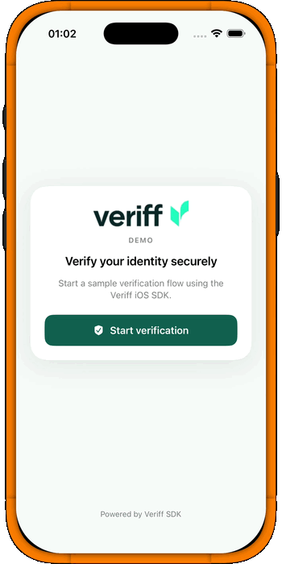

# veriffDemo




Demo iOS app showing how to integrate the [Veriff iOS SDK](https://github.com/Veriff/veriff-ios-spm) with Clean Architecture, SOLID principles, and modern SwiftUI.

A single screen creates a verification session against Veriff's `POST /v1/sessions` and immediately launches the SDK with the resulting URL. Every tap produces a fresh session — there is no hardcoded URL.

`HTTPSessionRepository` is the only `SessionRepositoryProtocol` implementation. It reads its config (API key + base URL) from a gitignored `Secrets.plist`. Without that file the app still launches but every verification attempt surfaces a clear "missing configuration" error in the UI, so the failure mode is discoverable instead of crashing.

## End-to-end flow

```
VerificationView (button tap)
  └─ VerificationViewModel.startVerification()
       └─ VerificationProviderProtocol.verify()                      # Domain seam
            └─ VeriffVerificationProvider.verify()                   # Data
                 ├─ SessionRepositoryProtocol.createSession()
                 │    └─ HTTPSessionRepository.createSession()
                 │         POST <baseURL>/v1/sessions
                 │         headers:  Content-Type: application/json
                 │                   X-AUTH-CLIENT: <api key from Secrets.plist>
                 │         body:     { "verification": {} }
                 │         response  → CreateSessionResponseDTO
                 │                   → SessionMapper.toDomain
                 │                   → VerificationSession(id, url)
                 └─ VeriffSdk.startAuthentication(sessionUrl:)
                      delegate → VeriffResultMapper → VerificationResult
       => VerificationResult.state =
            .completed | .cancelled | .failed(message)
```

If `Secrets.plist` is missing or its `VeriffAPIKey` is empty, `DependencyContainer` falls back to an internal `UnconfiguredSessionRepository` that throws `VerificationError.missingConfiguration`. The provider wraps any thrown `VerificationError` into `.failed`, which the view model maps to a user-visible message asking the developer to configure the file.

The provider also rejects overlapping starts: if `verify()` is invoked while another verification is in flight, it returns `.failed(.unknown(...))` immediately instead of leaking a continuation.

## Configuration

The repo includes a `Secrets.example.plist` template at the project root. Setup steps:

1. If `veriffDemo/Secrets.plist` does not exist, copy `Secrets.example.plist` into `veriffDemo/` and rename it to `Secrets.plist`.
2. In Xcode (or any plist editor), set `VeriffAPIKey` to a real API key from your Veriff Customer Portal → API keys.
3. Leave `VeriffBaseURL` as `https://stationapi.veriff.com` unless you have a different endpoint.
4. Re-run the app.

How the config is loaded:

- `VeriffAPIConfig.loadFromBundle()` reads `Secrets.plist` from the app bundle, validates that both keys are present and `VeriffAPIKey` is non-empty, and returns a `VeriffAPIConfig`.
- `DependencyContainer.makeSessionRepository()` returns `HTTPSessionRepository(config:)` when the config loads. Otherwise it returns an internal `UnconfiguredSessionRepository` that surfaces a clear error on first use — the app launches either way, so missing setup is obvious instead of fatal.

`veriffDemo/Secrets.plist` is gitignored, so the key never enters version control.

### A note on doing this in production

The Veriff docs do not explicitly forbid calling `POST /v1/sessions` from a mobile app. It works for sandbox / personal exploration, but **in a real product it should not be done from the device.** The recommended architecture is:

1. The iOS app calls **your own backend**, authenticated as the end-user.
2. Your backend calls Veriff's `POST /v1/sessions` with the private `X-AUTH-CLIENT` API key.
3. Your backend returns the resulting `verification.url` to the app.
4. The app passes that URL to the Veriff SDK.

Why:

- The Veriff API key never ships in the mobile binary (binaries are inspectable).
- The session is bound to your authenticated user on your side.
- You can apply rate limiting, fraud signals, and analytics centrally.
- You persist the user ↔ Veriff session mapping for webhooks.

Because the only seam Presentation depends on is `VerificationProviderProtocol`, swapping `HTTPSessionRepository` for a `BackendSessionRepository` is a one-line change inside `DependencyContainer`. Nothing in Presentation or Domain changes — that is the practical payoff of the layered architecture.

## Requirements

- Xcode 16 or newer (the project uses synchronized folder groups).
- iOS 17 or newer (uses `@Observable`).
- Swift 6.2 toolchain (the project enables `-default-isolation=MainActor`).
- The Veriff SDK is added via Swift Package Manager (`https://github.com/Veriff/veriff-ios-spm`).

## Running

1. Open `veriffDemo.xcodeproj`.
2. Configure `Secrets.plist` as described in **Configuration** above.
3. Select an iOS Simulator destination (Previews and the SDK do not run on physical devices via Previews).
4. Build and run.

Each tap of "Start verification" creates a fresh session via `POST /v1/sessions` and launches the Veriff SDK with the resulting URL.